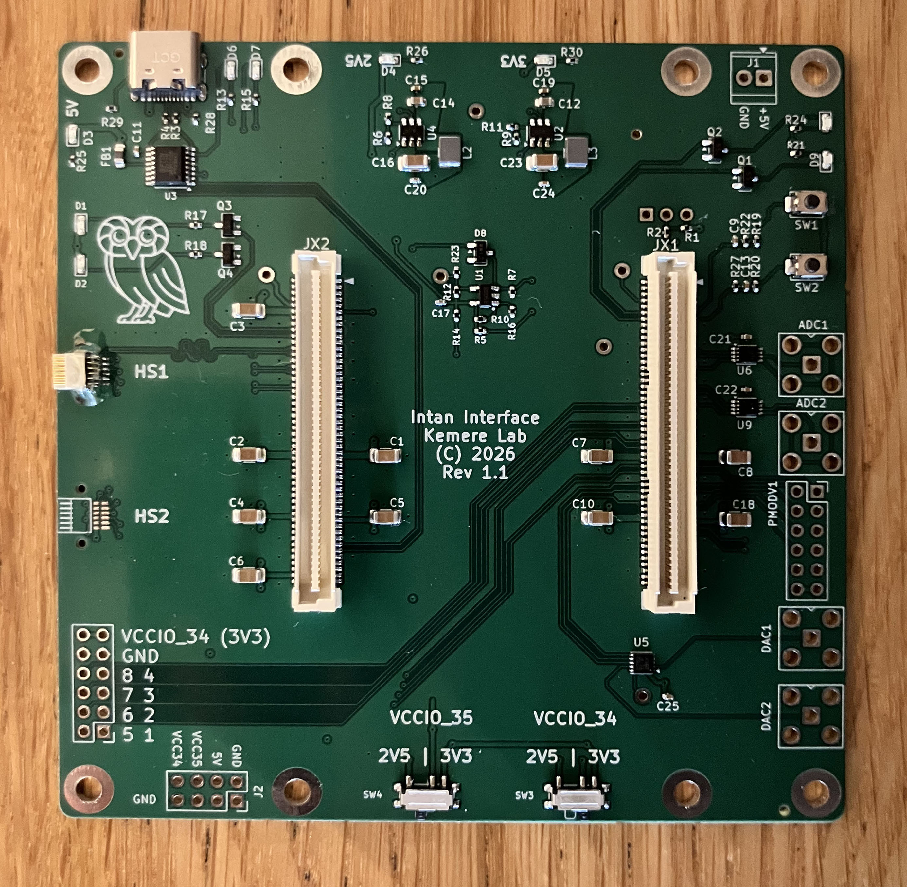

# GLANCE

**G**igabit **L**ow-latency **A**cquisition for **N**euroscience & **C**losed-loop **E**xperiments.

An FPGA data-acquisition interface for **Intan RHD2000-style neural recording chips**, built
on a **MicroZed** (Xilinx Zynq-7020) with a custom carrier PCB. The PL talks to up to two
cables of RHD2000 chips over a DDR SPI protocol; the PS streams the data over the network.

- Up to **256 channels @ 30 ksps** (two cables × 128 ch, Intan-standard 12-pin Omnetics, single + DDR).
- A user-programmable per-cable phase delay compensates for cable length.
- **TCP control** (port 0x6900 / 26880) + **UDP data stream** (port 0x6800 / 26624, ~9 MB/s per cable, ~18 MB/s at full config).
- Data path: `Intan ──SPI(DDR)──► PL ──BRAM──► (AXI CDMA) ──► PS ──UDP──► host`.

MicroZed SOMs are ~$300 (e.g. [Newark](https://www.newark.com/avnet/aes-z7mb-7z020-som-i-g-rev-h/eval-brd-32bit-fpga-arm-cortex/dp/62AJ7410)).
The carrier PCB (KiCad, manufactured at JLCPCB) lives in the
[**glance-neuro-hardware**](https://github.com/glanceneuro/glance-neuro-hardware) repo.

  
  

## Documentation

- **[Getting up and running](docs/getting-started.md)** — setting the VCCIO switches,
  assembling the board (Omnetics epoxy), the MicroZed boot jumpers, copying the boot image
  to SD, and building from source.

## Host software

The board's protocol has two reference clients (both speak TCP control + UDP capture):

- **`remote/net.py`** — a single-file Python client for bring-up, cable/phase auto-detection,
  and testing. The human-readable reference for the command set and packet format.
- **[glance-neuro-plugin](https://github.com/glanceneuro/glance-neuro-plugin)** — the OpenEphys
  GUI plugin for real recording and visualization (neural + aux/accelerometer channels, fast
  settle, banked aux commands).

  

The firmware (`firmware/`), `remote/net.py`, and the plugin are the **three consumers of the
same register/packet contract** — keep them in sync when changing the protocol.

## License

[MIT](LICENSE) © 2025–2026 Caleb Kemere, Reet Sinha, Allen Mikhailov, Rice University.
