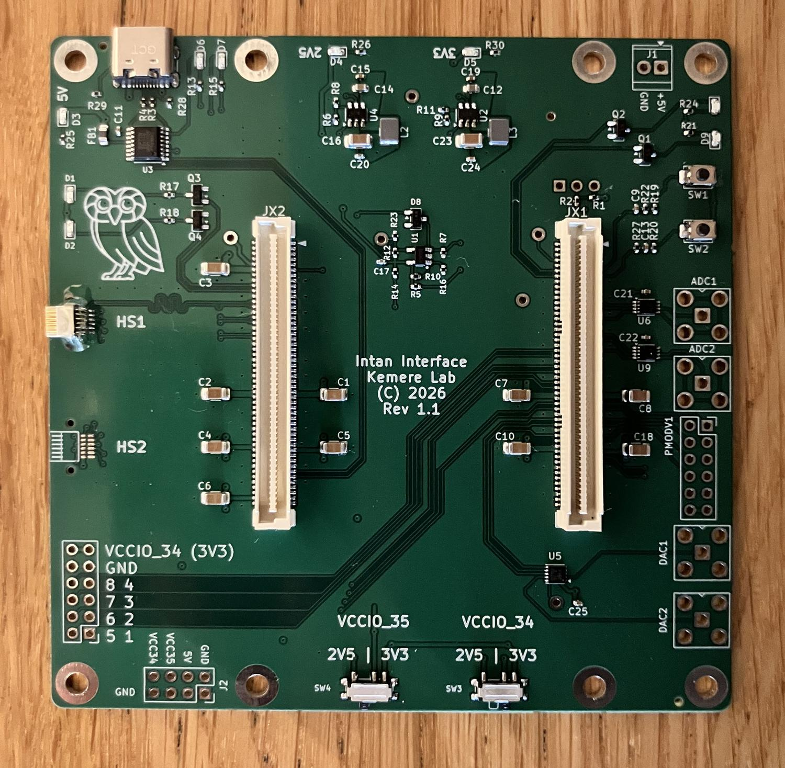
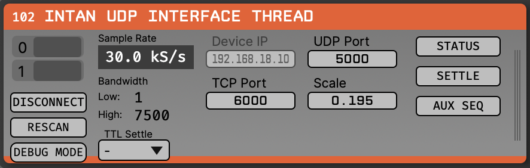

<picture>
  <source media="(prefers-color-scheme: dark)" srcset="resources/logo-darkmode.png">
  
</picture>

by the [Kemere Lab](https://kemerelab.com) at [Rice University](https://neuroengineering.rice.edu)

An FPGA data-acquisition interface for **Intan RHD2000-style neural recording chips**, built
on a **MicroZed** (Xilinx Zynq-7020) with a custom carrier PCB. The PL talks to up to two
cables of RHD2000 chips over a DDR SPI protocol; the PS streams the data over the network.

- Up to **256 channels @ 30 ksps** (two cables × 128 ch, Intan-standard 12-pin Omnetics, single + DDR).
- A user-programmable per-cable phase delay compensates for cable length.
- **TCP control** (port 0x6900 / 26880) + **UDP data stream** (port 0x6800 / 26624, ~9 MB/s per cable, ~18 MB/s at full config).
- Data path: `Intan ──SPI(DDR)──► PL ──BRAM──► (AXI CDMA) ──► PS ──UDP──► host`.
- **On-PL LFP band** — a second stream (`stream_type=2`) decimates the 30 kHz broadband to a ~3 kHz LFP band right in the PL (one half-band /2 + polyphase /5 FIR cascade), sharing the one UDP port. See [docs/lfp.md](docs/lfp.md).
- **DAC stimulus playback** — arbitrary analog waveforms out of two on-board SMA connectors (a dual-channel DAC70502), software- or hardware-triggered, looping or one-shot, and independent of neural acquisition. See [docs/stim.md](docs/stim.md).
- **Headstage IMU** — a BNO055 on each cable's freed second-CIPO pair, read over I2C and shipped as a third stream (`stream_type=3`) at 100 Hz: fused quaternion, accelerometer and gyroscope, stamped with the **PL master timestamp** so motion samples share the neural clock with no host-side alignment. See [docs/imu-ingestion.md](docs/imu-ingestion.md).
- **Runtime-swappable PL fabrics** — the board carries several programmable-logic configurations on the SD card and swaps between them on command, so a cable can trade its second CIPO pair for the IMU's I2C bus. `rescan` works out what is physically plugged in and loads the matching fabric. See [docs/boot.md](docs/boot.md).

MicroZed SOMs are ~$300 (e.g. [Newark](https://www.newark.com/avnet/aes-z7mb-7z020-som-i-g-rev-h/eval-brd-32bit-fpga-arm-cortex/dp/62AJ7410)).
The carrier PCB (KiCad, manufactured at JLCPCB) lives in the
[**glance-neuro-hardware**](https://github.com/glanceneuro/glance-neuro-hardware) repo.

  
  

## Documentation

- **[Getting up and running](docs/getting-started.md)** — setting the VCCIO switches,
  assembling the board (Omnetics epoxy), the MicroZed boot jumpers, copying the boot image
  to SD, and building from source.

**The contract** — change any of these and the firmware, `net.py` and the plugin move together:

- **[Protocol](docs/protocol.md)** — the TCP command set and the replies each command returns.
- **[Register map](docs/register-map.md)** — the AXI-Lite control/status bank at `0x40000000`.
- **[Unified packet format](docs/unified-packet-format.md)** — the UDP wire format: one common
  8-word header, demultiplexed by `stream_type`, one datagram per sample.

**Subsystems:**

- **[Boot and fabric swapping](docs/boot.md)** — how the board comes up, what is on the SD
  card, and the hardware-validated rules runtime PL reconfiguration has to respect.
- **[LFP band](docs/lfp.md)** — the on-PL decimation cascade, 30 kHz → ~3 kHz.
- **[Stimulus playback](docs/stim.md)** — the DAC70502 engine, triggering and waveform upload.
- **[IMU ingestion](docs/imu-ingestion.md)** — continuous BNO055 readout as a third stream.
- **[Headstage EEPROM](docs/headstage-eeprom.md)** — the decoded identity record and the I2C
  probe tooling that reads it.

**[Testing](docs/TESTING.md)** — what earns a test here, and what gets retired once it has
done its job.

## Host software

The board's protocol has two reference clients (both speak TCP control + UDP capture):

- **`remote/net.py`** — a single-file Python client for bring-up, cable/phase auto-detection,
  and testing. The human-readable reference for the command set and packet format.
- **[glance-neuro-plugin](https://github.com/glanceneuro/glance-neuro-plugin)** — the OpenEphys
  GUI plugin for real recording and visualization: broadband, the LFP band and the headstage
  IMU as three streams, plus aux/accelerometer channels, fast settle and banked aux commands.
  Its RESCAN button is what picks the PL fabric to match the headstages you have plugged in.

  

The firmware (`firmware/`), `remote/net.py`, and the plugin are the **three consumers of the
same register/packet contract** — keep them in sync when changing the protocol.

## License

[MIT](LICENSE) © 2025–2026 Caleb Kemere, Reet Sinha, Allen Mikhailov, Rice University.
