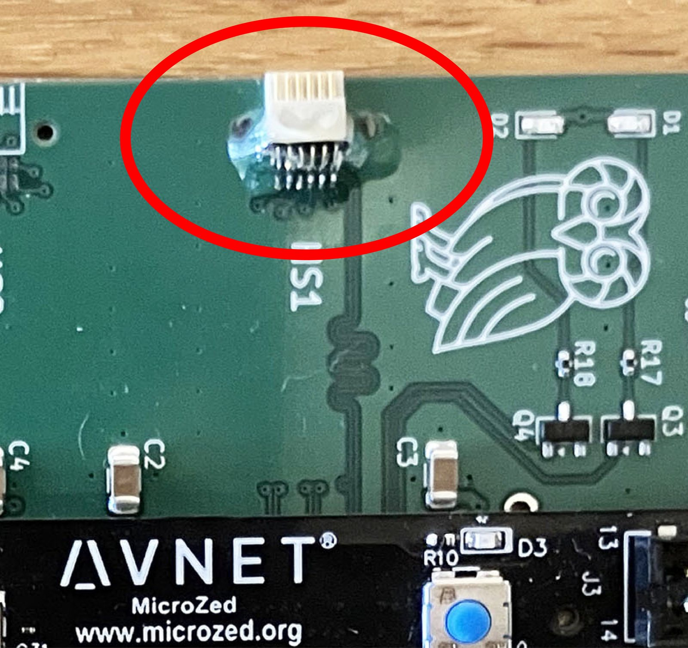

# Getting up and running

How to assemble a board, get a bootable image onto it, and make the first connection.
For the command/packet details see [`protocol.md`](protocol.md); for build internals and
conventions see [`../CLAUDE.md`](../CLAUDE.md).

## 1. Hardware

- A **MicroZed** Zynq-7000 SOM (7Z020; the 7Z010 should also work) on the
  [carrier PCB](../pcb/KiCad-Project/) (manufactured at JLCPCB).
- An Intan RHD2000-style headstage on a 12-pin Omnetics cable.
- A microSD card, Ethernet, and a **USB-C** cable. On the carrier the USB-C connector
  supplies **both power and the serial debug console** (UART) — the board draws about
  **0.65 A at 5 V**, so any standard USB-C port/charger is plenty.

<p align="center">
  
</p>

### Omnetics connector epoxy (do this)
The Omnetics 12-pin connector **requires epoxy reinforcement** — the pin-to-solder-pad
joints alone don't survive repeated mating. Apply several layers of UV-curing epoxy (we use
Bondic) to bond the connector body to the PCB; the through-holes by the connector are there
to anchor it. **Keep epoxy off the pins and the mating face.**

<p align="center">
  
</p>

## 2. MicroZed boot-mode jumpers (boot from SD)

The MicroZed selects its boot source with on-board jumpers. Set them for **SD-card boot**
as shown below:

<p align="center">
  
</p>

## 3. Put a bootable image on the SD card

The SD card needs a **FAT32** partition named **`Boot`** containing a `BOOT.bin`.

**Quickest — use the prebuilt image:** copy [`../blobs/BOOT.bin`](../blobs/BOOT.bin)
straight to the `Boot` partition. Insert the card, set the jumpers (step 2), power on.

**Or rebuild it** (see step 4), then:
```bash
bootgen -image scripts/boot.bif -o BOOT.bin -w   # produces BOOT.bin
cp BOOT.bin <SD Boot partition>/
```
`boot.bif` packs the FSBL + bitstream + both core ELFs. After **any PL change** the fresh
bitstream must be re-staged into the path `boot.bif` references before running `bootgen`
(see [`../CLAUDE.md`](../CLAUDE.md)).

## 4. Build from source (optional)

Needs **Vivado + Vitis 2025.1**.

```bash
# PL bitstream
source <vivado>/settings64.sh
vivado -mode batch -source scripts/create_vivado_project.tcl   # -> vivado_project/
vivado -mode batch -source scripts/build_bitstream.tcl         # -> vivado_project/klab_project.xsa

# PS firmware (both cores)
source <vitis>/settings64.sh
vitis -s scripts/create_vitis_project.py     # platform + both apps (clean vitis_workspace/ first)
vitis -s scripts/build_vitis_project.py      # incremental firmware-only rebuild
```
The part (`xc7z020clg400-1`) is set in `scripts/create_vivado_project.tcl`. A PL-only change
needs only a bitstream re-stage + `bootgen` (the firmware ELFs don't depend on PL clocks).
Full build notes and gotchas are in [`../CLAUDE.md`](../CLAUDE.md).

## 5. First connection

1. Plug in the USB-C (power) with the SD card inserted and wait for the Ethernet link. The
   **serial debug console** is on that same USB-C (115200 8N1) — open it in a terminal to
   watch boot/status messages (e.g. `CDMA: ready`, `CDMA: self-test OK`).
2. Put your host on the board's subnet (default board IP `192.168.18.10`).
3. Run the reference client:
   ```bash
   cd remote && python3 net.py      # connects to ZYNQ_IP (default 192.168.18.10)
   ```
   It auto-detects your host IP, points the board's UDP stream at you over TCP, and drops
   into an interactive prompt (`start`, `stop`, `get_status`, `auto_cable_detect`,
   `verify_sine`, …; type `help`). No chip needed — `set_debug 1` streams a synthetic sine.
4. For real recording/visualization use the **[ephys-socket](https://github.com/ckemere/ephys-socket)**
   OpenEphys plugin (drag **Intan Socket** in as the source, set the IP, **CONNECT** →
   **RESCAN** → play).
