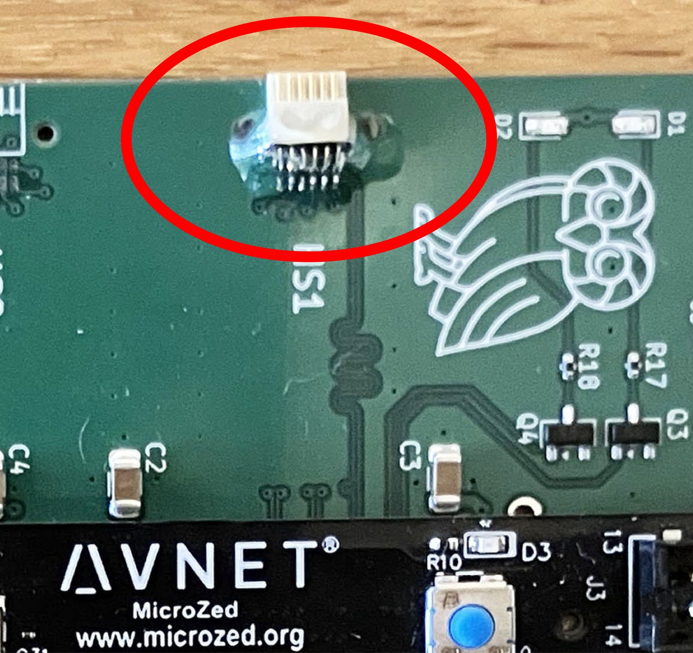

# Getting up and running

How to assemble a board, get a bootable image onto it, and make the first connection.
For the command/packet details see [`protocol.md`](protocol.md); for build internals and
conventions see [`../CLAUDE.md`](../CLAUDE.md).

## 1. Hardware

- A **MicroZed** Zynq-7000 SOM (7Z020; the 7Z010 should also work) on the
  [carrier PCB](https://github.com/glanceneuro/glance-neuro-hardware) (manufactured at JLCPCB).
- An Intan RHD2000-style headstage on a 12-pin Omnetics cable.
- A microSD card, Ethernet, and a **USB-C** cable. On the carrier the USB-C connector
  supplies **both power and the serial debug console** (UART) — the board draws about
  **0.65 A at 5 V**, so any standard USB-C port/charger is plenty.

<p align="center">
  
</p>

### Omnetics connector epoxy (do this)
The Omnetics 12-pin connector **requires epoxy reinforcement** — the pin-to-solder-pad
joints alone don't survive repeated mating. Apply several layers of UV-curing epoxy (we use
Bondic) to bond the connector body to the PCB; the through-holes by the connector are there
to anchor it. **Keep epoxy off the pins and the mating face.**

<p align="center">
  
</p>

## 2. MicroZed boot-mode jumpers (boot from SD)

The MicroZed selects its boot source with on-board jumpers. Set them for **SD-card boot**
as shown below:

<p align="center">
  
</p>

## 3. Put a bootable image on the SD card

The SD card needs a **FAT32** partition named **`Boot`** containing **everything in
`blobs/`** — not just `BOOT.bin`.

**Quickest — use the prebuilt image:** copy the whole of [`../blobs/`](../blobs/) to the
`Boot` partition. Insert the card, set the jumpers (step 2), power on.

`blobs/` is the SD image: `BOOT.bin` boots the board (it carries the FSBL, the default
acquisition bitstream, and both core ELFs, so the PL is configured before the network
exists — which is why the serial console and the DONE LED come up immediately), and the
four fabric files `acq.bin` / `aimuboth.bin` / `aimu_a.bin` / `aimu_b.bin` are what
`set_config` and `rescan` load at runtime.

Copying **only** `BOOT.bin` boots and streams, so it looks fine — but every fabric swap
then fails with `PL_ERR_OPEN`, which reads as a firmware bug rather than a missing file.

**Or rebuild it** — see step 4, which writes the whole set; then copy `blobs/*` across.

## 4. Build from source (optional)

Needs **Vivado + Vitis 2025.1**.

The repo ships a bootable image at `blobs/BOOT.bin`, built from the source beside it, so
you only need this if you are changing the design.

```bash
scripts/build_acq_loader.sh              # the whole set: BOOT.bin + four fabrics
scripts/build_acq_loader.sh --app-only   # firmware only; refuses if the PL changed
```

That is the whole build. **Use this script, not `scripts/build.sh`** — that one belongs to
the older monolithic config and writes `blobs/BOOT.bin` from a different bif, leaving the
four fabric blobs behind from another build. It fingerprints the PL sources to decide whether the four fabrics need re-synthesizing
(~72 min) or can be reused (~3 min), builds the firmware against the acq_imu_both `.xsa`
(the superset, so the BSP carries XIic), packages `blobs/BOOT.bin`, converts each fabric
to its PCAP `.bin`, and then checks what it made — every fabric's timing closed, and the
bitstream genuinely inside the boot image. It fails rather than emit an image it cannot
vouch for.

```bash
scripts/build.sh --check      # say what would be rebuilt, change nothing
scripts/build.sh --force-pl   # re-synthesize the PL even if unchanged
```

Needs **Vivado + Vitis 2025.1**; set `XILINX_ROOT` if they are not at `/opt/Xilinx/2025.1`.
The part (`xc7z020clg400-1`) is set in `scripts/create_vivado_project.tcl`.

Copy **the entire contents of `blobs/`** to the FAT32 boot partition — `BOOT.bin` boots
the board, and the four fabric `.bin` files are what `set_config` / `rescan` load at
runtime. Copying only `BOOT.bin` boots and streams, but every fabric swap then fails with
`PL_ERR_OPEN`, which looks like a firmware bug rather than a missing file.

## 5. First connection

1. Plug in the USB-C (power) with the SD card inserted and wait for the Ethernet link. The
   **serial debug console** is on that same USB-C (115200 8N1) — open it in a terminal to
   watch boot/status messages (e.g. `CDMA: ready`, `CDMA: self-test OK`).
2. Put your host on the board's subnet (default board IP `192.168.18.10`).
3. Run the reference client:
   ```bash
   cd remote && python3 net.py      # connects to ZYNQ_IP (default 192.168.18.10)
   ```
   It auto-detects your host IP, points the board's UDP stream at you over TCP, and drops
   into an interactive prompt (`start`, `stop`, `get_status`, `auto_cable_detect`,
   `verify_sine`, …; type `help`). No chip needed — `set_debug 1` streams a synthetic sine.
4. For real recording/visualization use the **[ephys-socket](https://github.com/ckemere/ephys-socket)**
   OpenEphys plugin (drag **Intan Socket** in as the source, set the IP, **CONNECT** →
   **RESCAN** → play).
